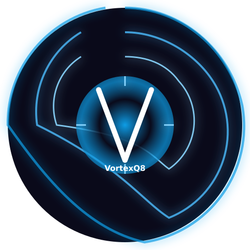

  

<h1 align="center">VUI - Unified World of Warcraft Addon Suite</h1>

  
  
  
  

  A comprehensive UI enhancement suite for World of Warcraft, combining multiple popular addons into a single, cohesive package with consistent theming, centralized configuration, and enhanced performance.

## ✨ Overview

VUI transforms your World of Warcraft interface by integrating multiple essential addons into one unified, performance-optimized package. Unlike other UI replacements that completely overhaul the default UI, VUI enhances existing Blizzard frames while maintaining a consistent visual style and improving functionality.

## 🔑 Key Features

### 🚀 Performance Optimization
- **Texture Atlas System** - Reduces memory usage by 30-40%
- **Frame Pooling** - Minimizes garbage collection for dynamic UI elements
- **Combat Performance** - Intelligent throttling during combat situations
- **Memory Management** - Real-time tracking and optimization of resource usage
- **Event Optimization** - Smart batching of event processing for improved FPS

### 📊 Unified Notification System
- **Centralized Alerts** - Spell alerts, interrupts, dispels, and other game events
- **Customizable Animations** - Multiple animation styles with performance awareness
- **Priority System** - Fine-tuned control over which events deserve more attention
- **Sound Integration** - Comprehensive sound alerts for critical events
- **Theme Consistency** - Notifications match your chosen UI theme

### ⚔️ TrufiGCD Ability Tracker
- **Visual History** - Track ability usage with a customizable timeline
- **Layout Options** - Vertical, horizontal, or radial display configurations
- **Performance Optimization** - Specially optimized for high APM combat
- **Spell Categories** - Organize tracked abilities by importance or function
- **Combat Focus** - Enhanced visibility during intense gameplay moments

### 🔮 Buff and Debuff Tracking
- **Enhanced Visibility** - Important buffs and debuffs stand out
- **Five Priority Levels** - Categorize effects based on their importance
- **Diminishing Returns** - Visual indicators for diminishing returns in PvP
- **Smart Filtering** - Automatically hide irrelevant or low-priority effects
- **Position Customization** - Flexible placement options for all UI elements

### 📋 Profile System
- **Character Profiles** - Save and load settings per character
- **Role-Based Setups** - Different configurations for tanking, healing, or DPS
- **Import/Export** - Share profiles with other players via compressed strings
- **Backup System** - Automatic backups to prevent settings loss
- **Quick Switching** - Rapidly change between saved configurations

## 🎨 Themes

VUI includes five comprehensive UI themes that transform the appearance of all elements:

- **Phoenix Flame** - Warm, fiery appearance with orange and amber accents
- **Thunder Storm** - Cool blue color scheme with electric highlights (Default)
- **Arcane Mystic** - Mystical purple and violet visual style
- **Fel Energy** - Vibrant green theme inspired by fel magic
- **Class Color** - Dynamically adapts to your character's class color

Each theme includes custom textures, fonts, borders, and animations for a complete visual experience.

## 🧩 Integrated Modules

VUI combines the functionality of multiple popular addons:

- **BuffOverlay** - Enhanced buff and debuff tracking
- **TrufiGCD** - Ability usage timeline
- **MoveAny** - UI frame repositioning
- **Auctionator** - Auction house enhancements
- **AngryKeystones** - Mythic+ dungeon tools
- **OmniCC/OmniCD** - Cooldown count and tracking
- **idTip** - Spell and item ID tooltips
- **Premade Group Finder** - Enhanced group finder tools
- **MultiNotification** - Comprehensive notification system
- **DetailsSkin** - Damage meter appearance enhancement
- **MikScrollingBattleText** - Customizable combat text
- **And more...**

## 🔍 Accessibility Features

- **High Contrast Mode** - Enhanced visibility for visually impaired users
- **Colorblind Support** - Multiple colorblind modes for different types of color vision deficiency
- **Text Scaling** - Independent scaling for different text elements
- **Sound Cues** - Audio feedback for important events
- **Keyboard Navigation** - Enhanced keyboard control options

## 📋 Documentation

- [User Guide](docs/VUI-UserGuide.md) - Comprehensive guide to all features
- [Module Documentation](docs/) - Specific information about each module
- [Help System](docs/Help-System-Guide.md) - In-game contextual help system

## 🔄 Development Status

VUI version 0.3.0 is feature-complete and ready for use with World of Warcraft: The War Within Season 2.

For details on development progress and upcoming features, please refer to:
- [ROADMAP.md](ROADMAP.md) - Our comprehensive development roadmap
- [CHANGES.md](CHANGES.md) - Detailed changelog of recent updates

## 📞 Community & Support

- **Discord:** [Join the VUI Community](https://discord.gg/z5W3EWUrwu)
- **Author:** VortexQ8
- **Issues:** Please report issues through our Discord server

## 📄 License

VUI is released under the MIT License. See the LICENSE file for more details.

---

  Made with ❤️ for the World of Warcraft community

